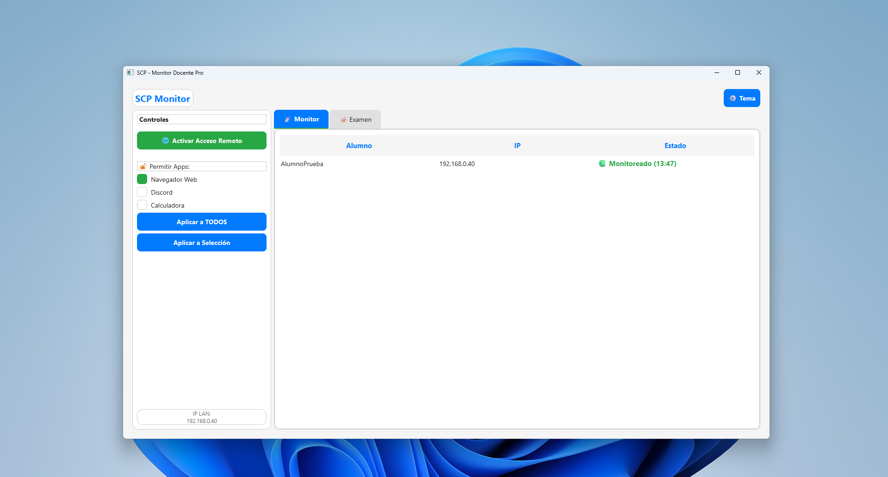
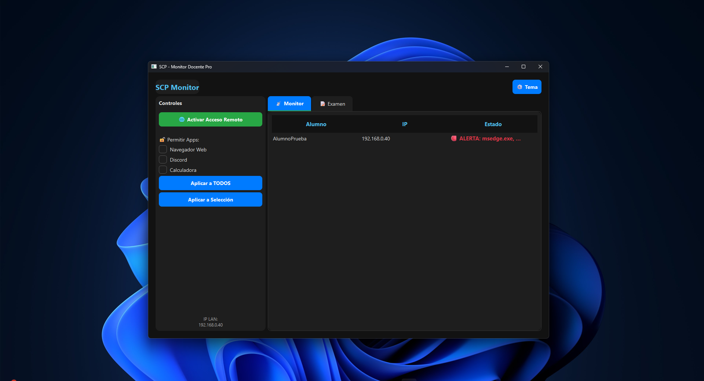
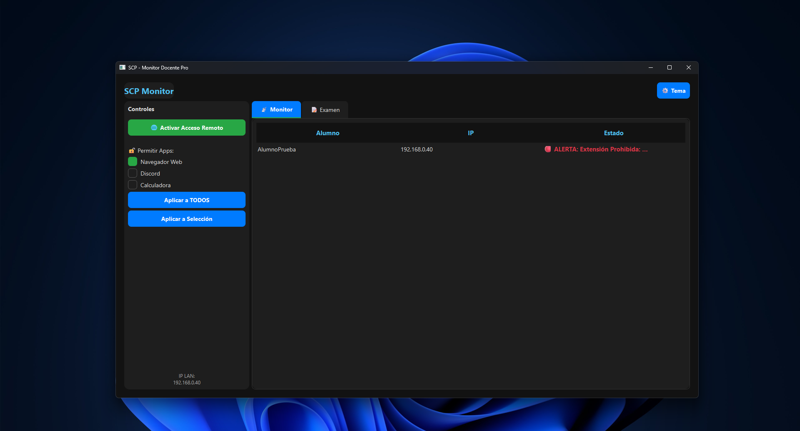
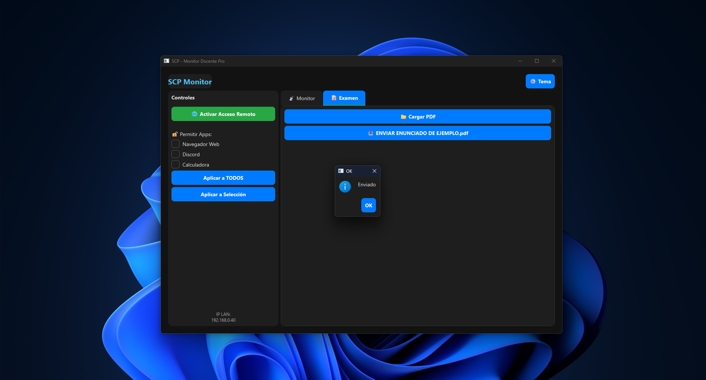
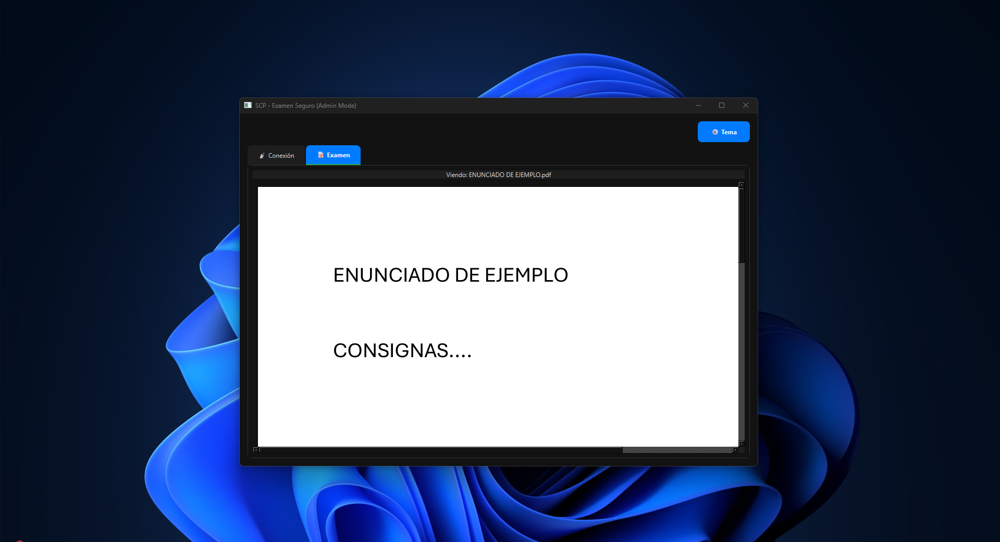
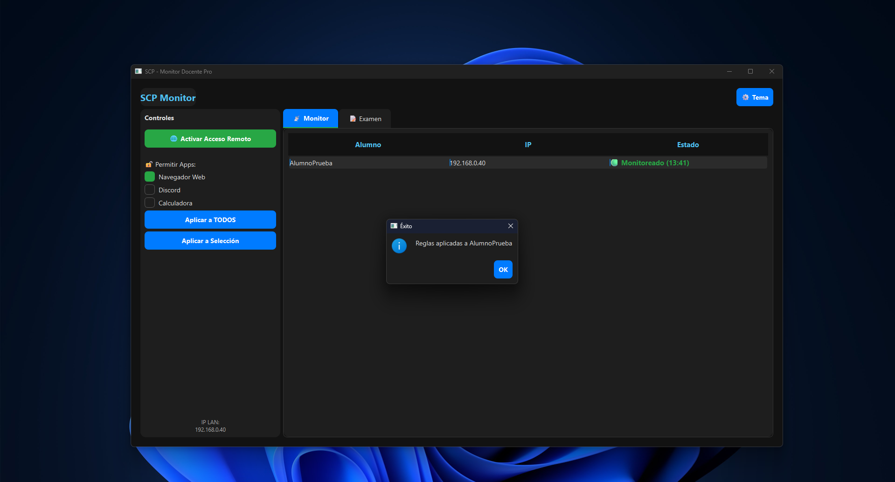
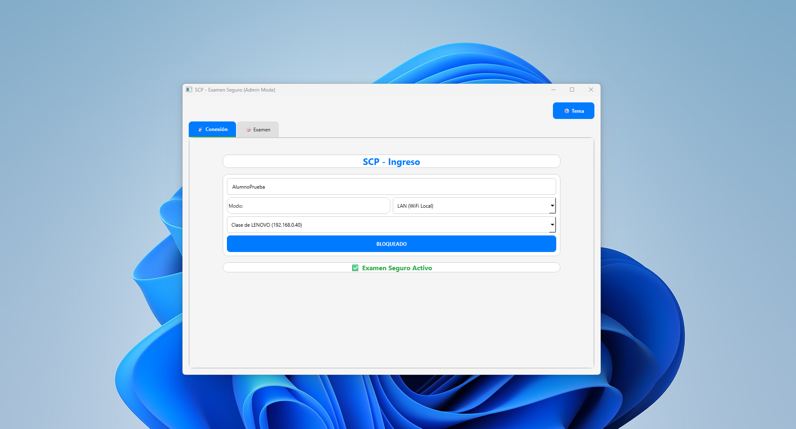
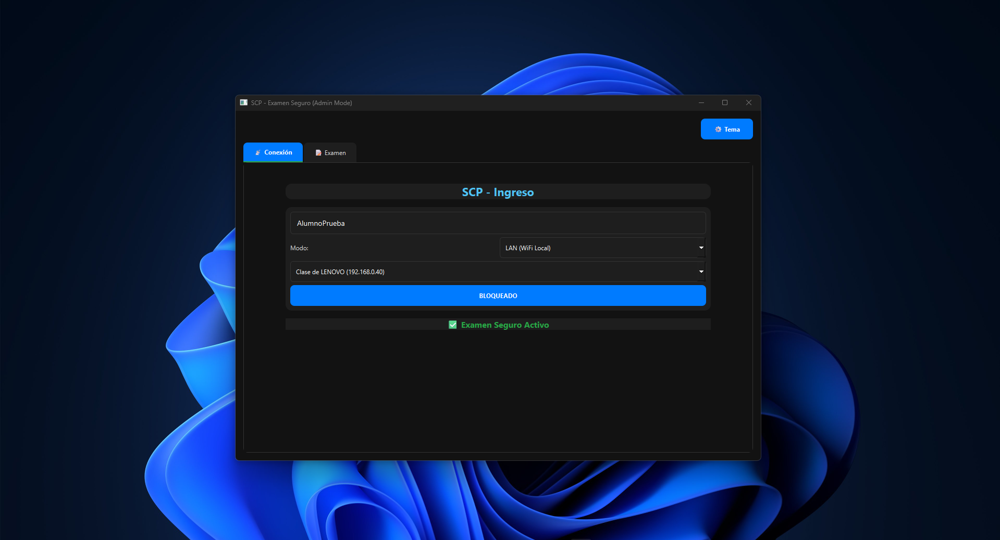

# 🛡️ SCP: Sistema de Control de Procesos (Alpha 2.0)
> **Integridad Académica Sin Fronteras.**
> La solución definitiva anti-plagio para exámenes de programación en tiempo real.

---

## 🚀 Novedades de la Versión Alpha 2.0
Esta versión introduce una defensa activa de "tolerancia cero" contra el fraude académico en entornos de programación.

* **👁️ Visión Artificial (OCR):** Análisis de capturas de pantalla en el servidor para detectar interfaces de IA (Copilot, ChatGPT) incluso si el alumno las oculta.
* **🌍 Conexión Global (Ngrok):** Integración nativa para conectar alumnos remotos con un solo clic.
* **🛡️ Defensa en Profundidad:**
    * Bloqueo preventivo de configuración en VS Code.
    * Detección de instalación de extensiones en tiempo real.
    * Vigilancia de procesos prohibidos (Chrome, Discord, etc.).

---

## 📸 Galería de Funcionalidades

### 1. Monitoreo en Tiempo Real
El docente tiene una vista centralizada del estado de todos los alumnos. El sistema diferencia visualmente entre un estado seguro (Verde) y una alerta (Rojo).

| Modo Claro (Seguro) | Modo Oscuro (Alerta de Proceso) |
| :---: | :---: |
|  |  |
| *Alumno conectado y monitoreado sin incidencias.* | *Alerta: El alumno abrió un proceso prohibido.* |

---

### 2. Defensa Anti-IA y Extensiones
El sistema es capaz de detectar intentos de trampa avanzados, como la instalación de extensiones de IA en tiempo real.

| Detección de Extensión en Cliente | Alerta en el Servidor |
| :---: | :---: |
|  |  |
| *El cliente detecta la instalación de 'Copilot Chat'.* | *El profesor recibe la alerta específica al instante.* |

---

### 3. Distribución de Exámenes y Reglas
El profesor puede enviar enunciados PDF y aplicar reglas de aplicaciones permitidas a uno o todos los alumnos con un solo clic.

| Envío de PDF | Recepción del Alumno |
| :---: | :---: |
|  |  |
| *Panel para cargar y enviar el examen.* | *El alumno recibe y visualiza el PDF integrado.* |

| Aplicación de Reglas | Confirmación |
| :---: | :---: |
|  | *Se pueden definir apps permitidas (Calculadora, etc.) y aplicarlas selectivamente.* |

---

### 4. Interfaz del Estudiante
Una interfaz simple y bloqueada diseñada para que el alumno se concentre en el examen.

| Conexión en LAN | Modo Examen Seguro |
| :---: | :---: |
|  |  |
| *Detección automática de profesores en la red.* | *Interfaz confirmando reglas aplicadas y estado seguro.* |

---

## 📦 Instalación

### Requisitos Previos
* **Sistema Operativo:** Windows 10 o 11 (64 bits).

### Pasos
1.  📥 **[HAZ CLIC AQUÍ PARA IR A LA DESCARGA](https://github.com/niclnt/SCP/releases/latest)**.
2.  Baja el archivo `Instalador_SCP_v2.0.exe`.
3.  Ejecuta el instalador y selecciona el componente que deseas (**Profesor** o **Estudiante**).
4.  Abre la aplicación desde el acceso directo en el escritorio.

---

## 🛠️ Tecnologías

| Componente | Tecnología | Función |
| :--- | :--- | :--- |
| **Core UI** | `PyQt6` | Interfaz gráfica moderna y responsiva (Modo Claro/Oscuro). |
| **Red** | `Sockets` + `pyngrok` | Comunicación TCP robusta y túneles para acceso remoto. |
| **Seguridad** | `psutil` + `ctypes` | Monitoreo de procesos y gestión de privilegios. |
| **Visión (IA)** | `pytesseract` + `Pillow` | OCR para detección de texto en capturas de pantalla. |
| **Empaquetado**| `PyInstaller` + `Inno Setup` | Compilación a .exe y creación del instalador. |

---
© 2026 SCP - Desarrollado por Nicolas Bustos - LNT Systems