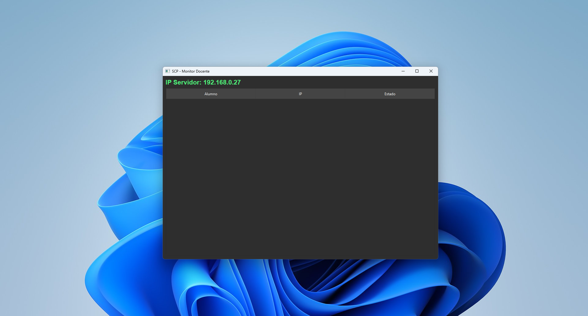

# 🛡️ SCP - ExamGuard
> **Sistema de Control y Proctoring para Entornos Educativos Seguros.**

## 🚀 ¿Qué es SCP?
SCP (Student Control Platform) es una solución de software diseñada para garantizar la integridad académica en exámenes digitales. Permite a los docentes monitorear en tiempo real el estado de las computadoras de los alumnos y bloquea automáticamente herramientas de Inteligencia Artificial no autorizadas.

**Versión Actual:** Alpha 1.0

---

## ✨ Características Principales

### 👨‍🏫 Para el Docente (Servidor)
* **Monitor en Tiempo Real:** Visualiza el estado de conexión de todos los alumnos en una sola pantalla.
* **Detección de Fraude:** Alertas instantáneas si el alumno abre navegadores (Chrome, Edge) o herramientas prohibidas.
* **Sin Configuración:** Detecta automáticamente la IP de la red Wi-Fi para facilitar la conexión.

### 👨‍🎓 Para el Alumno (Cliente)
* **Bloqueo de IA:** Deshabilita físicamente Copilot y otras extensiones de IA en VS Code durante el examen.
* **Cierre de Procesos:** Cierra automáticamente aplicaciones no permitidas.
* **Conexión Inteligente:** Detecta la clase automáticamente sin necesidad de escribir IPs complejas.

---

## 📥 Descarga e Instalación

No necesitas instalar Python ni librerías. Descarga el instalador oficial para Windows:

### [👉 DESCARGAR INSTALADOR (v1.0 Alpha)](https://github.com/niclnt/SCP/releases/latest)

**Requisitos:**
* Windows 10 o 11.
* Conexión a red local (Wi-Fi o Ethernet).

---

## 🛠️ Cómo Funciona

1.  **El Profesor** inicia `SCP_Profesor` en su computadora.
2.  **Los Alumnos** inician `SCP_Alumno` e ingresan su nombre.
3.  El sistema detecta automáticamente la clase y establece el "Modo Examen".
4.  Si un alumno intenta abrir una IA o un navegador, el sistema lo bloquea y avisa al profesor.

---

## 📄 Licencia y Créditos
Desarrollado por **Nicolas Bustos**.
Este software está protegido por derechos de autor.